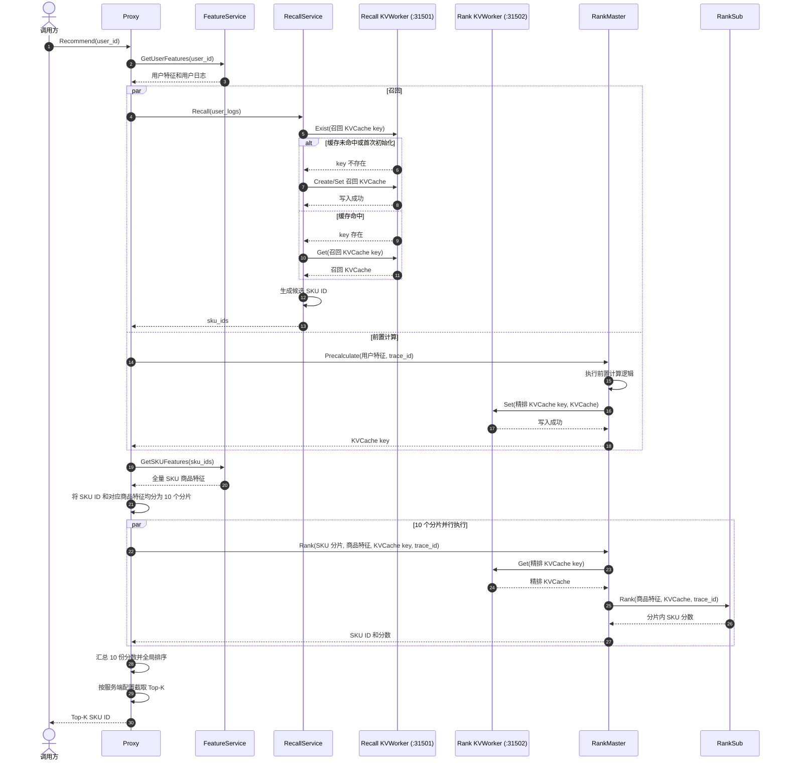

# LingQuickRec 系统设计文档

## 1. 概述

LingQuickRec 是一个 C++ 微服务系统，用于模拟搜索推荐系统的完整流水线时延，并验证通信优化效果。系统采用多阶段流水线架构，通过 BRPC 通信框架和 Protocol Buffers 序列化协议实现服务间通信。

**核心目标**：
- 模拟推荐系统的完整调用链路（特征获取 → 召回 → 预计算 → 精排）
- 衡量平均时延和 P99 时延两项关键指标
- 通过水平扩展和通信优化降低端到端时延

**技术栈**：

| 类别 | 技术 |
|------|------|
| 通信框架 | BRPC |
| 序列化 | Protocol Buffers |
| 服务发现 | 自研 Discovery Service |
| 日志 | common::logger（统一日志系统） |
| 错误码 | common::error::Status（0xMMTTCCCC） |
| 模型推理 | vLLM (Qwen3-0.6B) |
| KVCache | 元戎 (openYuanrong) |
| 容器化 | Docker + Docker Compose / Kubernetes |

## 2. 系统架构

### 2.1 整体架构图


### 2.2 服务列表

| 服务 | 端口 | Proto Service | 状态 | 说明 |
|------|------|---------------|------|------|
| Discovery | 8100 | DiscoveryService | 已完成 | 服务发现中心 |
| Proxy | 8080 | ProxyService | 已完成 | 网关入口 |
| Feature | 8003 | FeatureService | 已完成（模拟） | 特征服务 |
| Recall | 8001 | RecallService | 已完成 | 召回服务 |
| Precalc | 8004 | PrecalcService | 已完成 | 前置计算服务 |
| RankMaster | 8005 | RankMasterService | 已完成 | 精排主图服务 |
| RankSub | 8006 | RankSubService | 已完成 | 精排子图服务（可水平扩展） |

## 3. 服务流水线

### 3.1 请求流程

```
1. 外部请求 → Proxy (:8080)

2. Stage 1: 特征获取（同步）
   Proxy → FeatureService (:8003)
   获取 user_logs、user_feat 等用户特征数据

3. Stage 2: 召回 + 预计算（并行）
   Proxy ─┬→ RecallService (:8001)   → vLLM 推理 → 返回 sku_ids
          └→ PrecalcService (:8004)  → KVWorker 写入 → 返回 user_feat_key

4. Stage 3: 精排（同步）
   Proxy → RankMasterService (:8005)
   RankMaster 分发到多个 RankSub (:8006)
   每个 RankSub 从 KVWorker 读取特征 → 打分 → 返回分数
   RankMaster 聚合排序 → 返回 sorted candidates
```

### 3.2 阶段时序

| 阶段 | 调用方式 | 说明 |
|------|---------|------|
| Stage 1: 特征获取 | 同步阻塞 | 必须拿到特征后才能进行后续操作 |
| Stage 2a: 召回 | 异步并行 | 与 Stage 2b 同时发起 |
| Stage 2b: 预计算 | 异步并行 | 与 Stage 2a 同时发起 |
| Stage 3: 精排 | 同步阻塞 | 必须等 Stage 2a/2b 都完成 |

### 3.3 目标架构时序图（待实现）

前置计算能力合并到 RankMaster，不再单独部署 Precalc 服务，但原有执行时序保持不变：
Proxy 并行发起召回和前置计算，前置计算结果写入 KVWorker。两路都完成后，Proxy 将召回
得到的 `sku_ids` 交给 FeatureService 批量查询商品特征，再将 SKU ID 及其商品特征均分
为 10 个分片，并行发送给 10 个 RankMaster 实例。各 RankMaster 从精排专用 KVWorker
读取前置计算产生的 KVCache，调用 RankSub 完成分片打分。最终由 Proxy 汇总全部分片
结果、全局排序并返回 Top-K。召回和精排使用相互独立的 KVWorker。



> 说明：Recall 只访问召回 KVWorker，Precalc/RankMaster 只访问精排 KVWorker，两套缓存
> 相互独立。Precalc 只是合并进 RankMaster 的服务进程，仍与 Recall 并行执行，并继续负责
> 将计算结果写入精排 KVWorker。`RankMaster #1..#10` 表示 10 个 RankMaster 实例：前置
> 计算请求由其中一个实例处理，精排阶段由 10 个实例分别处理 Proxy 分配的 SKU 分片。
> 商品特征由 Proxy 从 FeatureService 批量获取并随分片下发，RankMaster 将商品特征和
> 读取到的精排 KVCache 传给 RankSub；RankSub 不再自行访问 KVWorker。RankMaster 返回
> 分片分数，全局排序职责归 Proxy。

## 4. 公共库

公共库 `common_lib` 为所有服务提供统一的基础设施，详见 [common/DESIGN.md](common/DESIGN.md)。

### 4.1 错误码体系

全域错误码采用 `0xMMTTCCCC` 格式：

```
 0x MM TT CCCC
 │   │  │   └── 具体错误码 (16bit)
 │   │  └────── 错误类型 (8bit)
 │   └────────── 模块代码 (8bit)
 └────────────── 固定前缀
```

**模块代码**：COMMON=0x00, GATEWAY=0x01, FEATURE=0x02, RECALL=0x03, PRECALC=0x04, RANK_MASTER=0x05, RANK_SUB=0x0A, DISCOVERY=0x09

**错误类型**：SUCCESS=0x00, INVALID_INPUT=0x01, SERVICE_ERROR=0x03, TIMEOUT=0x04

### 4.2 日志系统

- Singleton + Sink 模式，支持 ConsoleSink / FileSink
- 通过 `SetTraceIdGetter()` 回调自动附加 trace_id
- 与 brpc `LOG(INFO)` 宏兼容
- 支持 15 个占位符自定义输出格式

## 5. 服务发现

所有服务通过 Discovery Server (:8100) 进行服务注册与发现，详见 [services/discovery/DESIGN.md](services/discovery/DESIGN.md)。

### 5.1 架构

- **Discovery Server**：独立进程，维护内存注册表，提供 Register/Deregister/Heartbeat/Discover 四个 RPC
- **Discovery Client（sidecar）**：每个服务容器内运行一个独立进程，零侵入地向 Discovery Server 注册和发送心跳
- **消费者（Proxy/RankMaster）**：周期性调用 `Discover()` 获取 UP 实例列表，本地缓存

### 5.2 健康检查

- Client 侧：TCP 端口探测主服务健康状态
- Server 侧：心跳超时检测（2x interval → DOWN，5x interval → 清除）
- 异常退出兜底：kill -9 等场景由 Server 侧心跳超时兜底

### 5.3 容错策略

| 阶段 | 场景 | 行为 |
|------|------|------|
| 发现阶段 | 无 UP 实例 | 返回错误码，不继续 |
| 调用阶段 | 单次 RPC 失败 | 重试下一个 UP 实例 |
| 调用阶段 | 全部实例失败 | 返回服务错误 |
| 熔断 | 连续 3 次失败 | 标记 cooldown（10s） |

## 6. Protobuf 协议

所有服务间通信使用 Protocol Buffers 定义，proto 文件位于 `proto/` 目录：

| 文件 | 定义 |
|------|------|
| `proxy.proto` | ProxyService.Recommend |
| `feature.proto` | FeatureService.GetUserFeatures / GetSKUFeatures |
| `recall.proto` | RecallService.Recall |
| `precalc.proto` | PrecalcService.Precalculate |
| `rank_master.proto` | RankMasterService.Rank |
| `rank_sub.proto` | RankSubService.RankSub |
| `discovery.proto` | DiscoveryService.Register/Deregister/Heartbeat/Discover |

所有 proto 文件均启用 `option cc_generic_services = true`，由 BRPC 框架处理 HTTP↔Protobuf 转换。

## 7. 端口分配

| 端口 | 服务 | 协议 | 说明 |
|------|------|------|------|
| 8080 | Proxy | BRPC HTTP | 网关入口 |
| 8100 | Discovery | BRPC | 服务发现中心 |
| 8001 | Recall | BRPC | 召回服务 |
| 8003 | Feature | BRPC | 特征服务 |
| 8004 | Precalc | BRPC | 前置计算服务 |
| 8005 | RankMaster | BRPC | 精排主图服务 |
| 8006 | RankSub | BRPC | 精排子图服务（可扩展 8006-8015） |
| 8000 | vLLM | HTTP | 大模型推理 API（容器内部） |
| 31501 | KVWorker (Recall) | 元戎 SDK | 召回 KV 缓存 |
| 31502 | KVWorker (Rank) | 元戎 SDK | 精排 KV 缓存 |

## 8. 目录结构

```
LingQuickRec/
├── CMakeLists.txt                 # 项目级构建入口
├── README.md                      # 项目说明
├── DESIGN.md                      # 本文档
├── build.sh                       # 全量编译脚本
├── common/                        # 公共基础库（错误码/日志）
├── proto/                         # 所有服务的 proto 文件
├── services/
│   ├── discovery/                 # 服务发现中心（server + client）
│   ├── proxy/                     # 网关服务
│   ├── feature/                   # 特征服务（模拟实现）
│   ├── recall/                    # 召回服务
│   ├── precalc/                   # 前置计算服务
│   ├── rank_master/               # 精排主图服务
│   ├── rank_sub/                  # 精排子图服务
│   └── kv_worker/                 # 元戎数据系统（Dockerfile）
└── deploy/
    ├── docker/                    # Docker 镜像 + docker-compose
    └── k8s/                       # Kubernetes 部署配置
```

每个服务遵循统一的目录结构：

```
services/<name>/
├── CMakeLists.txt
├── Dockerfile
├── README.md
├── DESIGN.md
├── server/
│   ├── include/     # 头文件（ServiceImpl 声明）
│   └── src/         # 源文件（main.cpp + 实现文件）
├── client/          # 测试客户端
└── tests/           # 集成测试
```

## 9. 部署方案

### 9.1 Docker Compose

```bash
# 构建并启动所有服务
docker compose -f deploy/docker/docker-compose.yml build
docker compose -f deploy/docker/docker-compose.yml up -d

# 水平扩展 RankSub
docker compose -f deploy/docker/docker-compose.yml up -d --scale rank-sub=10
```

### 9.2 Kubernetes

部署配置位于 `deploy/k8s/`，支持 ReplicaSet 级别的水平扩展。

### 9.3 服务注册

每个容器通过 sidecar 进程（`discovery_client`）向 Discovery Server 注册，启动命令模式：

```bash
/app/<service_binary> --server_port=<port> &
/app/discovery_client --service_type=<name> --service_port=<port> --discovery_addr=discovery:8100 &
wait
```

## 10. 测试策略

### 10.1 集成测试

每个服务提供单进程集成测试，在同一进程内启动 Mock Server 模拟完整调用链：

| 服务 | 测试文件 | 覆盖场景 |
|------|---------|---------|
| Proxy | `services/proxy/tests/integration_test.cpp` | 全链路成功 + 4 种下游失败 |
| 其他服务 | `services/<name>/tests/` | 正常流程 + 边界情况 |

测试不依赖任何外部服务，使用 `assert()` 断言结果。

### 10.2 单元测试

公共库测试位于 `common/tests/`：
- `test_error.cpp` — 错误码编码/解码

## 11. 演进规划

| 阶段 | 状态 | 内容 |
|------|------|------|
| V1.0 | 已完成 | 核心服务（Recall/Precalc/RankMaster/RankSub） |
| V1.1 | 已完成 | 服务发现（Discovery Server/Client） |
| V1.2 | 已完成 | 网关服务（Proxy + 动态发现 + 熔断） |
| V1.3 | 已完成 | 特征服务（Feature，模拟实现） |
| V2.0 | 规划中 | Feature 对接真实数据源（Redis/KuaiRand） |
| V2.1 | 规划中 | 轻量级探针和监控可视化 |
| V2.2 | 规划中 | 健康检查 + 自动扩缩容 |
