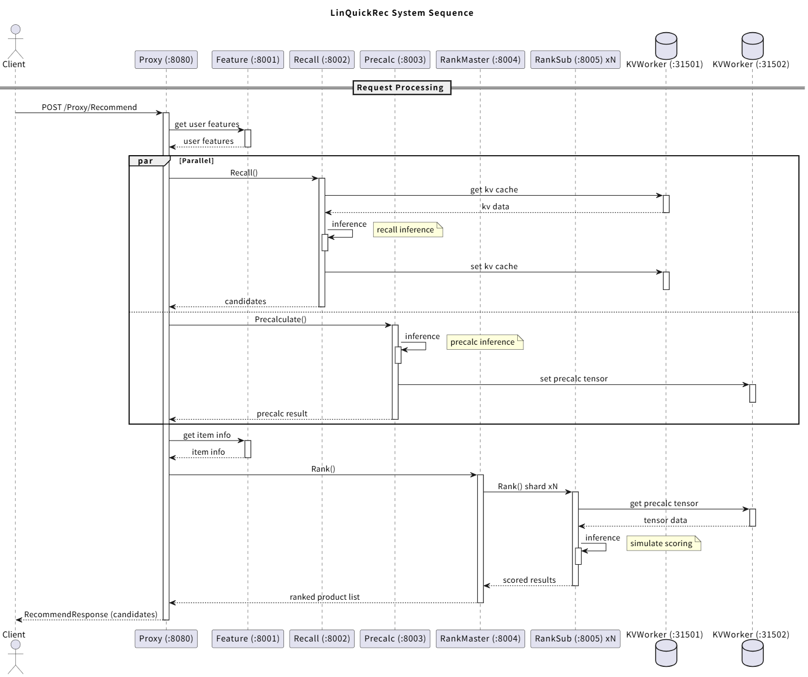

# LingQuickRec — 搜推广时延模拟系统

## 项目简介

本项目是一个搜推广时延模拟与通信优化验证系统，采用 BRPC 通信框架和 Protocol Buffers 序列化协议，通过多阶段流水线架构模拟推荐系统的完整调用链路。系统关注平均时延和 P99 时延两项主要指标，验证UB特性对于系统性能的提升效果。

## 系统架构



## 依赖列表

| 类别 | 技术 | 版本 |
|------|------|------|
| 通信框架 | BRPC | 1.15.0 |
| 序列化 | Protocol Buffers | v25.5 |
| 命令行参数 | gflags | v2.2.2 |
| KV 存储 | leveldb | 1.23 |
| 服务发现 | etcd | v3.5 |
| KVCache | 元戎 (openYuanrong Datasystem) | v0.7.0 |
| 模型推理 | vLLM (Qwen3-0.6B) | v0.11.0 |
| 深度学习框架 | PyTorch | v2.8.0 |
| JSON 处理 | RapidJSON | v1.1.0 |
| 日志 | common::logger | 项目内 |
| 线程池 | common::ThreadPool | 项目内 |
| 错误码 | common::error::Status（0xMMTTCCCC） | 项目内 |
| 基座 OS | openEuler | 24.03 SP3 LTS |
| GPU | NVIDIA RTX 4090D | — |
| 容器化搭建 | Docker + Docker Compose | — |
| 容器化部署 | Kubernetes | — |

## 服务列表

| 服务 | 端口 | Proto Service | 状态 | 依赖 |
|------|------|---------------|------|------|
| Discovery | - | DiscoveryService | ✅ 已完成 | — |
| Proxy | 8080 | ProxyService | ✅ 已完成 | Discovery, Feature, Recall, Precalc, Rank |
| Recall | 8002 | RecallService | ✅ 已完成 | vLLM, KVWorker |
| Precalc | 8003 | PrecalcService | ✅ 已完成 | KVWorker |
| RankMaster | 8004 | RankMasterService | ✅ 已完成 | Discovery, RankSub |
| Feature | 8001 | FeatureService | ✅ 模拟实现 | — |
| KVWorker | 31502 | — | 由元戎提供服务 | etcd (internal) |
| vLLM | 8000 | — | 模型服务 | Qwen3-0.6B |

## 对外接口

系统通过 Proxy 对外暴露 HTTP 接口，客户端通过 `POST /Proxy/Recommend` 提交推荐请求并接收排序结果。Proxy 通过 [服务发现](#服务发现) 自动调度下游服务，客户端无需感知内部拓扑。

### 请求

```
POST /Proxy/Recommend
Content-Type: application/json
```

```json
{
  "user_id": 12345,
  "payload": "optional data"
}
```

### 响应

**成功：**

```json
{
  "candidates": [100001, 100002, 100003],
  "error_code": 0,
  "error_message": ""
}
```

**失败：**

```json
{
  "candidates": [],
  "error_code": 16973825,
  "error_message": "FeatureService: connection refused"
}
```

### error_code 编码

错误码采用 `0xMMTTCCCC` 格式，详见 [错误码体系](#错误码体系)。

## 配置参考

所有可配置参数详见 [CONFIG.md](CONFIG.md)，包括各服务 gflag、环境变量映射及生效方式。

## 编译命令

### 基础镜像

编译与运行依赖的基础镜像 `linquickrec/base:latest` 基于 `openeuler:24.03-sp3-lts`，包含以下组件：

| 类别 | 组件 | 版本 | 集成方式 |
|------|------|------|---------|
| 系统包 | CMake | >= 3.14 | yum install cmake |
| 系统包 | GCC | >= 12 | yum install gcc-c++ |
| 系统包 | curl | latest | yum install curl |
| 系统包 | OpenSSL | OpenSSL_1_1_1m | yum install openssl-devel |
| 手动编译 | BRPC | 1.15.0 | 源码编译 → `make install` |
| 手动编译 | Protobuf | v25.5 | 源码编译 → `make install` |
| 手动编译 | gflags | v2.2.2 | 源码编译 → `make install` |
| 手动编译 | leveldb | 1.23 | 源码编译 → `make install` |
| 手动编译 | Abseil-cpp | latest | 源码编译 → `make install` |
| Python whl | PyTorch | v2.8.0 | `pip install torch-2.8.0*.whl` |
| Python whl | vLLM | v0.11.0 | `pip install vllm-0.11.0*.whl` |
| Python whl | 元戎 Datasystem | v0.7.0 | `pip install openyuanrong_datasystem-0.7.0*.whl` |
| 模型参数 | Qwen3-0.6B | — | 模型文件，约 1.2GB |
| 硬件 | NVIDIA RTX 4090D | — | 物理 GPU，需安装 NVIDIA 驱动 + CUDA |

### 前置依赖

| 依赖 | 版本要求 | 备注 |
|------|----------|------|
| CMake | >= 3.14 | 编译工具链 |
| BRPC | 1.15.0 | 基础镜像 `linquickrec/base:latest` 已内置 |
| Protobuf | v25.5 | 同上 |
| gflags | v2.2.2 | 同上 |
| leveldb | 1.23 | 同上 |
| Abseil-cpp | latest | 同上 |
| RapidJSON | v1.1.0 | 项目 `3rdparty/rapidjson/` 内嵌 |

### 脚本构建

```bash
chmod +x build.sh
./build.sh              # 默认为 Release 构建
./build.sh release      # Release 构建
./build.sh debug        # Debug 构建
./build.sh clean        # 清理后构建
```

### 手动构建

```bash
mkdir -p build && cd build
cmake .. -DCMAKE_BUILD_TYPE=Release
make -j$(nproc)
```

### 编译产物

| 二进制 | 所属服务 | 说明 |
|--------|---------|------|
| `discovery_server` | Discovery | 服务发现中心服务端 |
| `discovery_client` | Discovery | 服务发现客户端（sidecar 进程） |
| `proxy_server` | Proxy | 网关服务 |
| `proxy_test_client` | Proxy | 网关手动测试客户端 |
| `proxy_integration_test` | Proxy | 网关集成测试 |
| `recall_server` | Recall | 召回服务 |
| `recall_test_client` | Recall | 召回测试客户端 |
| `precalc_server` | Precalc | 前置计算服务 |
| `precalc_test_client` | Precalc | 前置计算测试客户端 |
| `rank_master_server` | RankMaster | 精排主图服务 |
| `rank_master_test_client` | RankMaster | 精排主图测试客户端 |
| `rank_sub_server` | RankSub | 精排子图服务 |
| `rank_sub_client` | RankSub | 精排子图测试客户端 |
| `pseudo_service` | Discovery/examples | 模拟业务服务 |
| `test_discover` | Discovery/examples | 发现功能测试 |
| `test_register` | Discovery/examples | 注册/反注册测试 |
| `test_heartbeat_cycle` | Discovery/examples | 生命周期测试 |

## 目录结构

```
LinQuickRec-yh/
├── CMakeLists.txt             # 项目级构建入口
├── README.md
├── build.sh                   # 全量编译脚本
├── .agents/                   # AI 辅助技能（brpc-cmake, git-commit 等）
├── common/                    # 公共基础库（错误码/日志/线程池）
├── deploy/
│   ├── docker/                # 各服务的容器镜像定义 + docker-compose
│   └── k8s/                   # Kubernetes 部署配置
├── docs/                      # 文档
│   ├── ports.md               # 端口配置
│   └── API.md                 # API 接口文档
├── proto/                     # 所有服务的 proto 文件
├── services/
│   ├── discovery/             # 服务发现中心
│   ├── feature/               # 特征服务（模拟实现）
│   ├── kv_worker/             # 元戎数据系统
│   ├── precalc/               # 前置计算服务
│   ├── proxy/                 # 网关服务
│   ├── rank_master/           # 精排主图服务
│   ├── rank_sub/              # 精排子图服务
│   └── recall/                # 召回服务
```

## 容器搭建

容器构建与部署详见 [deploy/docker/README.md](deploy/docker/README.md)。

## 核心功能

### 端到端推荐系统

系统通过 Proxy 对外暴露 HTTP 接口，客户端提交推荐请求后，Proxy 依次调用 Feature、Recall、Precalc、RankMaster 和 RankSub 服务，最终返回排序结果。整个调用链路模拟了真实推荐系统的多阶段流水线架构。

### 服务发现

系统使用 **etcd**（etcd v3 集群）作为服务发现后端（也支持自研 discovery_server 后端，通过 `--registry_backend=discovery_server` 切换）。

所有服务容器在启动时通过 sidecar 进程（`discovery_client`）向 etcd 完成实例注册，注册信息包括服务类型、地址、端口和唯一实例标识。注册后 etcd lease keep-alive 机制自动维护心跳，lease 过期后实例自动被移除。

Proxy 作为网关入口，不配置任何下游服务的静态地址。每次请求到达时，Proxy 向 etcd 查询指定服务类型的全部 UP 实例，通过负载均衡策略选取目标实例发起调用。

调用失败时的降级策略：

| 阶段 | 失败场景 | 降级行为 |
|------|---------|---------|
| 发现阶段 | 某服务类型无 UP 实例 | 直接返回对应错误码，不继续后续阶段 |
| 调用阶段 | 单次 RPC 失败 | 自动重试下一个 UP 实例 |
| 调用阶段 | 全部实例均失败 | 返回服务错误，中断当前阶段 |
| 熔断 | 同一实例连续多次失败 | 标记为不健康，冷却后恢复 |

下游实例列表在 Proxy 内部定时缓存刷新，减少每次请求的发现开销。

详见 [Discovery/README.md](services/discovery/README.md)。

### 错误码体系

全域错误码体系采用 `0xMMTTCCCC` 格式，不同服务之间均使用统一的错误码体系：

- **MM (8bit)** — 模块代码（COMMON=0x00, PROXY=0x01, RECALL=0x03, ...）
- **TT (8bit)** — 错误类型（SUCCESS/INVALID_INPUT/SERVICE_ERROR/...）
- **CCCC (16bit)** — 具体错误码

详见 [common/DESIGN.md](common/DESIGN.md#2-错误码体系)。

### 负载均衡

上游服务通过 Discovery 获取下游服务的全部 UP 实例列表，使用 round-robin 策略选取目标实例。单次调用失败后自动重试下一个实例，连续多次失败触发熔断（10s cooldown）。

### 负载仿真

系统通过以下方式模拟真实推荐场景的负载特征：

- **时延注入**：RankSub 通过 `--scoring_delay_ms` 参数模拟不同计算开销的商品打分时延
- **数据仿真**：测试客户端可指定 SKU 数量、tensor 大小、payload 大小等参数，模拟不同规模的数据传输
- **并发仿真**：Proxy 全局线程池可配置并发度，模拟不同并发请求量下的系统行为
- **副本扩缩**：Recall、Precalc、RankMaster、RankSub 均支持多副本部署，通过 docker-compose scale 模拟集群规模变化

## 后续开发

- [x] common 公共基础库（错误码/日志/线程池）
- [x] Recall 服务端和客户端
- [x] Precalc 服务端和客户端
- [x] RankMaster + RankSub 精排服务
- [x] Proxy 网关服务
- [x] Discovery 服务发现中心
- [x] etcd 服务发现后端支持
- [x] API 接口文档
- [x] Feature 服务端和客户端（模拟实现）
- [ ] Feature 对接真实数据源（KuaiRand / Redis）
- [ ] 实现轻量级探针和数据采集
- [ ] 构建监控可视化界面
- [ ] 添加自动扩缩容支持
